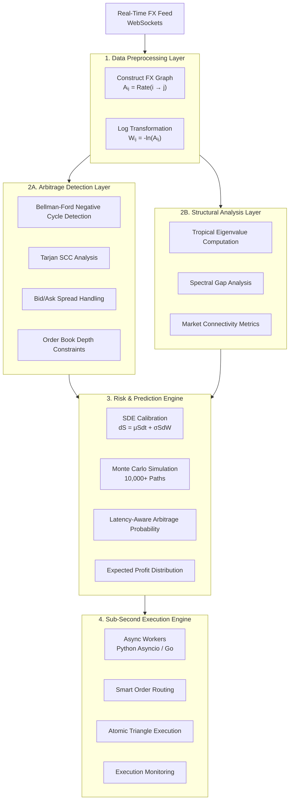

# FOREX_farming

```mermaid
flowchart TD

    A[Real-Time FX Feed<br/>WebSockets]

    A --> B

    subgraph B["1. Data Preprocessing Layer"]
        B1["Construct FX Graph<br/>Aᵢⱼ = Rate(i → j)"]
        B2["Log Transformation<br/>Wᵢⱼ = -ln(Aᵢⱼ)"]
    end

    B --> C
    B --> D

    subgraph C["2A. Arbitrage Detection Layer"]
        C1["Bellman-Ford Negative Cycle Detection"]
        C2["Tarjan SCC Analysis"]
        C3["Bid/Ask Spread Handling"]
        C4["Order Book Depth Constraints"]
    end

    subgraph D["2B. Structural Analysis Layer"]
        D1["Tropical Eigenvalue Computation"]
        D2["Spectral Gap Analysis"]
        D3["Market Connectivity Metrics"]
    end

    C --> E
    D --> E

    subgraph E["3. Risk & Prediction Engine"]
        E1["SDE Calibration<br/>dS = μSdt + σSdW"]
        E2["Monte Carlo Simulation<br/>10,000+ Paths"]
        E3["Latency-Aware Arbitrage Probability"]
        E4["Expected Profit Distribution"]
    end

    E --> F

    subgraph F["4. Sub-Second Execution Engine"]
        F1["Async Workers<br/>Python Asyncio / Go"]
        F2["Smart Order Routing"]
        F3["Atomic Triangle Execution"]
        F4["Execution Monitoring"]
    end
```
