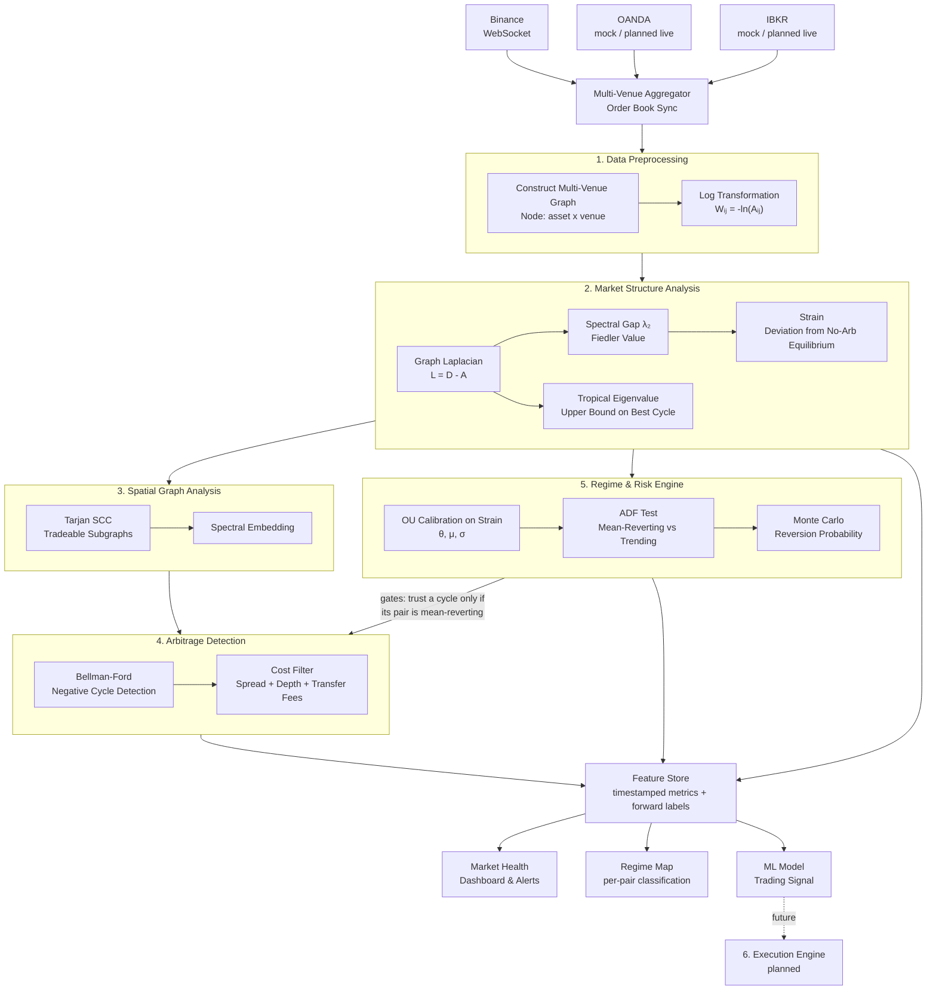

# FOREX_farming

A real-time, cross-venue market structure engine for cryptocurrency exchange rates. It builds a live directed graph of currency pairs across multiple brokers, analyses the graph's structure and dynamics, and turns that analysis into three concrete outputs: a market health signal, a per-pair regime classification, and engineered features for predictive trading models.

> Currently streaming Binance (BTC, ETH, BNB, SOL) over a K4 intra-venue graph, with OANDA and IBKR wired in as mock feeds pending real broker integration.

---

## How it works

Every tick, live order book data from multiple exchanges is assembled into a single directed graph where nodes are `(asset, venue)` pairs and edges are exchange rates — both within a venue (trading) and across venues (transferring). That graph is analysed two ways: structurally, via spectral graph theory, and dynamically, via a calibrated stochastic process fit to its history. Triangular and cross-venue arbitrage cycles are detected as a side effect of this analysis, not as the end goal.

The point of building it this way: the same underlying question — *how efficiently does this market correct itself when something pushes it out of equilibrium* — turns out to answer three different practical questions depending on how you frame it. That reframing is the actual subject of this README.

---

## The Multi-Venue Graph Model

Nodes are `(asset, venue)` pairs, not just assets — `BTC@Binance` and `BTC@Coinbase` are distinct nodes. Two edge types exist: intra-venue trading edges (`Wᵢⱼ = -ln(bid or 1/ask)`) and inter-venue transfer edges (`Wᵢⱼ = -ln(1 - transfer_fee)`). A profitable loop across both edge types — say, sell ETH for BTC on Binance, transfer BTC to Coinbase, sell BTC for ETH, transfer back — only beats the combined trading and transfer fees if the price gap between venues is large enough. Cross-venue cycles are also gated by transfer latency: on-chain settlement can take seconds to minutes, by which point the gap that created the opportunity is often gone, which is why pre-funded balances on every venue (collapsing the transfer leg to zero-latency internal accounting) are the practical way this would ever be exploitable.

---

## Architecture

### Layer 1 — Data Preprocessing
Order books from every connected venue are merged into one unified state keyed by `(asset, venue)`. Intra-venue and inter-venue edges are constructed each tick and log-transformed into weight matrix `W`, turning the multiplicative arbitrage problem into an additive one: a profitable loop becomes a negative-weight cycle.

### Layer 2 — Market Structure Analysis
Three structural signals come from the Graph Laplacian `L = D - A`. The spectral gap `λ₂` (second-smallest Laplacian eigenvalue) measures how well-connected the market is right now — high means mispricing propagates and closes quickly, low means the graph is fragmented and deviations may persist. The tropical eigenvalue gives a hard upper bound on the best possible arbitrage rate, letting detection be skipped entirely when no profitable cycle can exist. Strain measures how far the observed graph deviates from the no-arbitrage equilibrium where every cycle's product equals 1.

### Layer 3 — Spatial Graph Analysis
Tarjan's algorithm finds Strongly Connected Components, pruning the graph down to only the subsets where a closed trading loop is actually possible — illiquid pairs and disconnected venues drop out before Bellman-Ford ever runs. Spectral embedding projects the remaining nodes into low-dimensional space, surfacing which venues and assets cluster together.

### Layer 4 — Arbitrage Detection
Bellman-Ford runs only on the SCC-pruned subgraph, and only on cycles that Layer 5 confirms are sitting in a statistically mean-reverting regime — a cycle in a trending or random-walk regime might widen instead of close, so detecting a negative cycle there is not the same thing as having found real arbitrage. Surviving cycles pass a cost filter (spread, depth, transfer fees) and are written to the Feature Store with their full path and profit.

### Layer 5 — Regime & Risk Engine
Strain is not assumed to be a random walk — it's modelled as an Ornstein-Uhlenbeck process, `dX = θ(μ - X)dt + σdW`, which is the correct model for a quantity that gets pulled back toward an equilibrium rather than wandering freely. Calibrating θ, μ, and σ from the strain history gives a statistically grounded read on how fast this market self-corrects. An Augmented Dickey-Fuller test confirms whether that mean reversion is real or just noise, classifying each pair into a mean-reverting or trending regime — this is what gates Layer 4. Monte Carlo paths from the calibrated process then produce probabilistic features: probability of reversion within N seconds, expected time-to-reversion, and quantile-based risk bounds.

### Layer 6 — Execution Engine *(planned)*
Async order routing and atomic cross-leg execution, built only on signals that have cleared the regime gate and the feature store's validation. Not the current focus.

---

## What this project can actually deliver

Three concrete things come out of this pipeline, and they're not independent products bolted together — they're the same underlying measurement (how efficiently this market self-corrects) read at three different resolutions.

**Market health.** The spectral gap and strain, tracked against a rolling baseline, tell you whether the market is currently well-connected or fragmented — a live diagnostic, alertable when a venue or asset cluster starts diverging from its normal behaviour. This is the snapshot view: is the market okay right now.

**Regime classification.** Calibrating θ per pair and validating it with an ADF test tells you whether that specific pair is currently mean-reverting (efficient, deviations correct) or trending (inefficient, deviations persist or grow). This is the time-series view: what kind of market behaviour is this pair exhibiting, and is a detected arbitrage cycle even likely to close. It's also what separates this project from a naive scanner — a negative cycle only means something once the regime confirms it's the closing kind.

**Trading signals.** Every structural metric, regime classification, and detected cycle gets logged into a timestamped feature store, alongside forward-looking labels (realised return, or probability of reversion within a horizon). That dataset is the input to a predictive model — the spectral and regime metrics stop being descriptive and become engineered features with a testable claim: does market structure predict what happens next.

The interesting part is where these three disagree. If the graph looks structurally healthy but θ shows a pair isn't actually reverting, that mismatch — not either metric alone — is the most informative signal the system produces.

---

## The math in one paragraph

Taking the log of exchange rates converts triangular arbitrage from a multiplicative to an additive problem: a loop is profitable when `Aᵢⱼ · Aⱼₖ · Aₖᵢ > 1`, equivalently `Wᵢⱼ + Wⱼₖ + Wₖᵢ < 0`, a negative-weight cycle Bellman-Ford finds in O(VE) time. The spectral gap of the graph Laplacian measures how fast such mispricings diffuse and close structurally; the tropical eigenvalue bounds the best achievable cycle without running detection at all; Tarjan SCC restricts search to the reachable, liquid portion of the graph. Separately, modelling strain as an Ornstein-Uhlenbeck process and testing it with Augmented Dickey-Fuller gives a second, independent estimate of the same efficiency concept — this time from the time-series dynamics rather than the graph's structure — and the two together produce more than either alone: a cross-validated read on whether the market is genuinely self-correcting right now.

---

## Current status

| Layer | Status |
|---|---|
| WebSocket feed + order book dashboard (Binance) | ✅ Done |
| K4 intra-venue graph (6 live pairs) | ✅ Done |
| Multi-broker aggregator (Binance live, OANDA/IBKR mock) | ✅ Done |
| FX graph + log transform | ✅ Done |
| Bellman-Ford cycle detection | ✅ Done |
| Multi-venue graph (asset × venue nodes, transfer edges) | 📋 Planned |
| Spectral structure (Laplacian, λ₂, tropical eigenvalue, strain) | 🔧 In progress |
| Spatial analysis + SCC pruning | 🔧 In progress |
| OU calibration + ADF regime classification | 📋 Planned |
| Regime-gated arbitrage detection | 📋 Planned |
| Feature store + forward labels | 📋 Planned |
| ML model / signal validation | 📋 Planned |
| Execution engine | 📋 Planned |

---

## Stack

- **Python** — core pipeline, asyncio event loop
- **websockets** — multi-venue order book feeds
- **numpy / scipy** — Laplacian construction, eigenvalue computation, OU calibration
- **statsmodels** *(planned)* — Augmented Dickey-Fuller test for regime classification
- **Go** *(planned)* — execution layer for sub-millisecond order dispatch per venue

---

## Disclaimer

This is a research and feature-engineering tool, not an automated trading system. Detected cycles and regime classifications are logged for analysis, not executed. Live execution at retail scale competes against co-located, microsecond-latency infrastructure that this project has no intention of trying to beat — the value here is in the structural and statistical analysis, and in producing a defensible, testable dataset, not in chasing fleeting price gaps.
