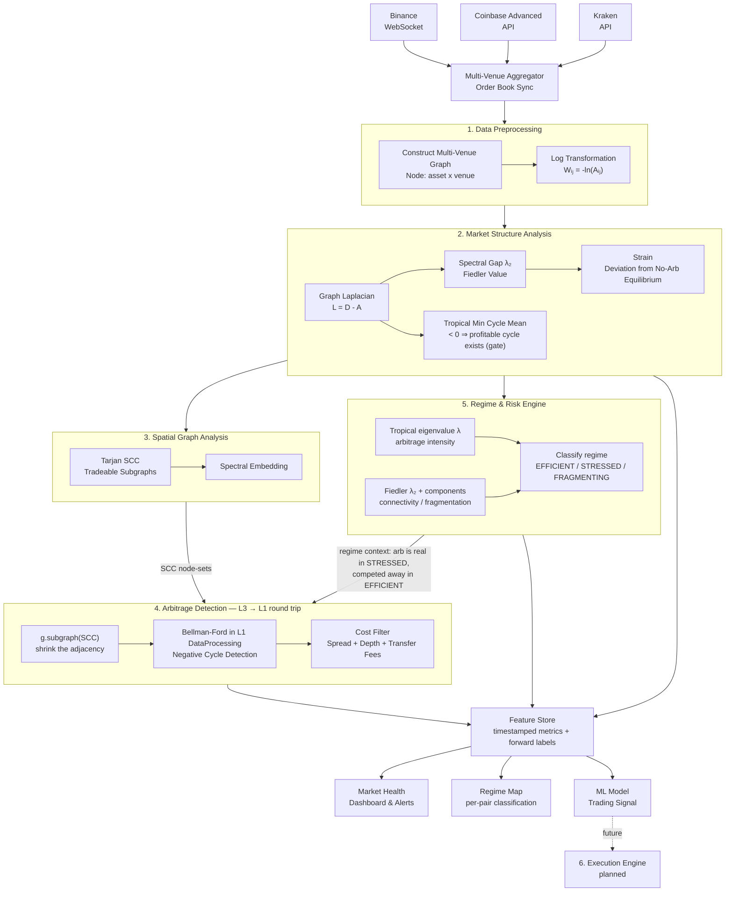
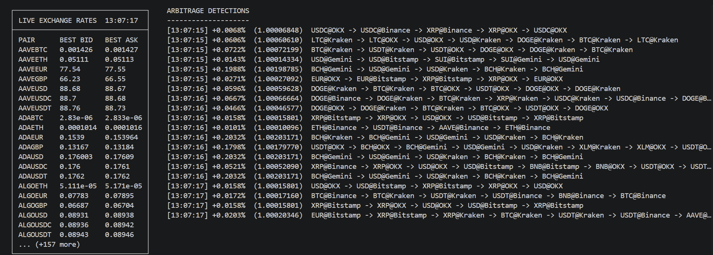
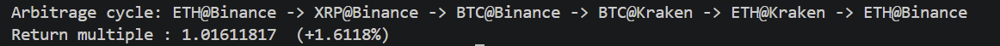

# FOREX_farming

A real-time, cross-venue market structure engine for cryptocurrency exchange rates. It builds a live directed graph of currency pairs across multiple brokers, analyses the graph's structure and dynamics, and turns that analysis into three concrete outputs: a **market health signal**, a **per-pair regime classification**, **and ML feature engineering for trading signals**.

> Currently streaming Binance (BTC, ETH, BNB, SOL) over a K4 intra-venue graph, with OANDA and IBKR wired in as mock feeds pending real broker integration.

Disclaimer: This repo also has Claude as a big help. Hence if there exists certain errors or unreadable code, such as URLmethods.py, then excuse me.

---

## How it works

Every tick, live order book data from multiple exchanges is assembled into a single directed graph where nodes are `(asset, venue)` pairs and edges are exchange rates — both within a venue (trading) and across venues (transferring). That graph is analysed two ways: structurally, via spectral graph theory, and dynamically, via a calibrated stochastic process fit to its history. Triangular and cross-venue arbitrage cycles are detected as a side effect of this analysis, not as the end goal.

The point of building it this way: the same underlying question — *how efficiently does this market correct itself when something pushes it out of equilibrium* — turns out to answer three different practical questions depending on how you frame it. That reframing is the actual subject of this README.

---

## The Multi-Venue Graph Model

Nodes are `(asset, venue)` pairs, not just assets — `BTC@Binance` and `BTC@Coinbase` are distinct nodes. Two edge types exist: intra-venue trading edges (`Wᵢⱼ = -ln(bid or 1/ask)`) and inter-venue transfer edges (`Wᵢⱼ = -ln(1 - transfer_fee)`). A profitable loop across both edge types — say, sell ETH for BTC on Binance, transfer BTC to Coinbase, sell BTC for ETH, transfer back — only beats the combined trading and transfer fees if the price gap between venues is large enough. Cross-venue cycles are also gated by transfer latency: on-chain settlement can take seconds to minutes, by which point the gap that created the opportunity is often gone, which is why pre-funded balances on every venue (collapsing the transfer leg to zero-latency internal accounting) are the practical way this would ever be exploitable.

---

## Initializing

\ python L3_TarjanSCC/TarjanSCC.py 
\ python -m L3_TarjanSCC.TarjanSCC
\ from L3_TarjanSCC.TarjanSCC import find_all_arbitrage
\ cd L3_TarjanSCC && python setup.py build_ext --inplace

---

## Architecture

### Layer 1 — Data Preprocessing
Order books from every connected venue are merged into one unified state keyed by `(asset, venue)`. Intra-venue and inter-venue edges are constructed each tick and log-transformed into weight matrix `W`, turning the multiplicative arbitrage problem into an additive one: a profitable loop becomes a negative-weight cycle. 

Furthermore, this stage also help showing how normal arbitrage loop without the further layers can be like. The implementation of L2 -> L4 is mainly for pushing the graph finding quicker and more efficient and also to conclude different aspects of the market such as L2 can shows the "market health", if spectral sum goes up, then its healthy and vice versa. Appearantly, we want it to go down, then when it goes down, there is more volatility then the arbitrage occurs better

### Layer 2 — Market Structure Analysis
Three structural signals come from the Graph Laplacian `L = D - A`. The spectral gap `λ₂` (second-smallest Laplacian eigenvalue) measures how well-connected the market is right now — high means mispricing propagates and closes quickly, low means the graph is fragmented and deviations may persist. The tropical (min-plus) eigenvalue is the **minimum cycle mean** of the `-ln(rate)` weights: it is negative exactly when a profitable cycle exists anywhere in the graph, so it acts as a cheap go/no-go gate — when it is `≥ 0` (no profitable cycle possible) the reduction and detection are skipped entirely for that tick. Strain measures how far the observed graph deviates from the no-arbitrage equilibrium where every cycle's product equals 1. This layer is diagnosis only — it scores the whole market and gates; it does **not** shrink the graph (that is Layer 3).

### Layer 3 — Spatial Graph Analysis
This is the layer that actually makes the graph smaller. Tarjan's algorithm finds Strongly Connected Components and drops the singletons — a profitable cycle must live *entirely* inside one SCC, so the subsets where no closed trading loop is possible (illiquid pairs, disconnected venues) fall out before Bellman-Ford ever runs. Spectral embedding then *ranks* the remaining SCCs by instability so the most promising one is searched first — but ranking only reorders, it never drops nodes (a spectral cut could slice through a real cycle and lose the arbitrage). Layer 3's output is the node-set of each non-trivial SCC. 

### Arbitrage Detection — the L3 → L1 round trip (no separate layer)
There is no standalone detection layer. Detection is the loop closing back on Layer 1: for each SCC node-set Layer 3 marks tradeable, the engine calls `ExchangeRateGraph.subgraph(scc)` to shrink the adjacency, then runs that smaller graph's own `find_arbitrage()` — the Bellman-Ford that already lives in L1's DataProcessing. This turns the `O(V·E)` sweep over the whole graph into a sum over tiny components. Detection runs only on cycles that Layer 5 confirms are in a statistically mean-reverting regime — a cycle in a trending or random-walk regime might widen instead of close, so a negative cycle there is not the same thing as real arbitrage. Surviving cycles pass a cost filter (spread, depth, transfer fees) and are written to the Feature Store with their full path and profit. Until Layer 3 is real, the spatial stub returns `None` and the engine searches the whole graph once.

### Layer 5 — Regime & Risk Engine
This layer no longer tries to *forecast* arbitrage. An earlier version modelled the tropical eigenvalue as an Ornstein-Uhlenbeck process and forecast whether the next tick would clear the fee — but on a 1-second tape that eigenvalue has ~zero one-step autocorrelation, and any opening reverts in well under the round-trip execution latency, so a *tradeable* forecast is not possible at this observation scale. That is the market being efficient, not the model failing. (The OU work is preserved on the `archive/ou-arbitrage-attempt` branch.)

So Layer 5 **measures** the market's regime rather than predicting it, from two spectra of the live graph every tick:
- **arbitrage intensity** — the tropical (max-plus) eigenvalue `λ`: the best per-hop cycle return, i.e. how mispriced the market is right now;
- **connectivity** — the Fiedler value `λ₂` (algebraic connectivity of the *unweighted* Laplacian, so zero-cost cross-venue transfer edges don't spuriously split the graph) plus the number of connected components. Unlike the single-tick arb spikes, connectivity is *persistent*, so it is actually usable at 1 Hz.

Each tick is classified into one of three regimes:
- **EFFICIENT** — connected and quiet: `λ` at/under the fee, prices consistent across venues (the normal, well-arbitraged state);
- **STRESSED** — still one connected market, but `λ` far above the fee: large dislocations are open (a fast move, one venue lagging, a volatility spike) while the graph is structurally intact;
- **FRAGMENTING** — the graph has split into ≥ 2 components (or `λ₂ ≈ 0`): venues/assets decoupling, liquidity withdrawing. The top structural risk, so it overrides regardless of `λ`.

`regime_engine.py` streams this live — a terminal readout plus a rolling 2-D regime map of connectivity vs arbitrage-intensity — and ships an offline `--demo` that classifies all three regimes with no feed. ADF/Monte-Carlo reversion features remain a possible future add-on, but only for connectivity, which has the persistence the arb intensity lacks.

### Layer 6 — Execution Engine *(planned)*
Async order routing and atomic cross-leg execution, built only on signals that have cleared the regime gate and the feature store's validation. Not the current focus.

---

## What this project can actually deliver

Three concrete things come out of this pipeline, and they're not independent products bolted together — they're the same underlying measurement (how efficiently this market self-corrects) read at three different resolutions.

**Market health.** The spectral gap and strain, tracked against a rolling baseline, tell you whether the market is currently well-connected or fragmented — a live diagnostic, alertable when a venue or asset cluster starts diverging from its normal behaviour. This is the snapshot view: is the market okay right now.

**Regime classification.** Calibrating θ per pair and validating it with an ADF test tells you whether that specific pair is currently mean-reverting (efficient, deviations correct) or trending (inefficient, deviations persist or grow). This is the time-series view: what kind of market behaviour is this pair exhibiting, and is a detected arbitrage cycle even likely to close. It's also what separates this project from a naive scanner — a negative cycle only means something once the regime confirms it's the closing kind.

**Trading signals.** Every structural metric, regime classification, and detected cycle gets logged into a timestamped feature store, alongside forward-looking labels (realised return, or probability of reversion within a horizon). That dataset is the input to a predictive model — the spectral and regime metrics stop being descriptive and become engineered features with a testable claim: does market structure predict what happens next.

The interesting part is where these three disagree. If the graph looks structurally healthy but θ shows a pair isn't actually reverting, that mismatch — not either metric alone — is the most informative signal the system produces.

---

## The math in one paragraph

Taking the log of exchange rates converts triangular arbitrage from a multiplicative to an additive problem: a loop is profitable when `Aᵢⱼ · Aⱼₖ · Aₖᵢ > 1`, equivalently `Wᵢⱼ + Wⱼₖ + Wₖᵢ < 0`, a negative-weight cycle Bellman-Ford finds in O(VE) time. The spectral gap of the graph Laplacian measures how fast such mispricings diffuse and close structurally; the tropical (min-plus) eigenvalue is the minimum cycle mean of the weights — negative exactly when a profitable cycle exists — so it gates detection without running it at all; Tarjan SCC then shrinks the graph to the reachable, liquid portion, and Bellman-Ford runs on each smaller component (the L3 → L1 round trip). Separately, modelling strain as an Ornstein-Uhlenbeck process and testing it with Augmented Dickey-Fuller gives a second, independent estimate of the same efficiency concept — this time from the time-series dynamics rather than the graph's structure — and the two together produce more than either alone: a cross-validated read on whether the market is genuinely self-correcting right now.

---

## Current status

| Layer | Status |
|---|---|
| WebSocket feed + order book dashboard (Binance) | ✅ Done |
| K4 intra-venue graph (6 live pairs) | ✅ Done |
| Multi-broker aggregator (Binance live, OANDA/IBKR mock) | ✅ Done |
| FX graph + log transform | ✅ Done |
| Bellman-Ford cycle detection (in L1 DataProcessing) | ✅ Done |
| Subgraph reduction + per-SCC detection wiring (L3 → L1 round trip) | ✅ Done |
| Multi-venue graph (asset × venue nodes, transfer edges) | ✅ Done |
| Spectral structure (Laplacian, λ₂, tropical eigenvalue, strain) | ✅ Done |
| Regime engine (spectral EFFICIENT / STRESSED / FRAGMENTING classifier) | ✅ Done |
| Spatial analysis + SCC pruning | 🔧 In progress |
| OU arbitrage forecasting | ❌ Shelved — no 1 Hz predictability (archived) |
| Regime-gated arbitrage detection | 📋 Planned |
| Feature store + forward labels | 📋 Planned |
| ML model / signal validation | 📋 Planned |
| Execution engine | 📋 Planned |

---

## Stack

- **Python** — core pipeline, asyncio event loop
- **websockets** — multi-venue order book feeds
- **numpy / scipy** — Laplacian construction, eigenvalue computation, OU calibration
- **statsmodels** *(planned)* — Augmented Dickey-Fuller test for regime classification
- **Go** *(planned)* — execution layer for sub-millisecond order dispatch per venue

---

## Disclaimer

This is a research and feature-engineering tool, not an automated trading system. Detected cycles and regime classifications are logged for analysis, not executed. Live execution at retail scale competes against co-located, microsecond-latency infrastructure that this project has no intention of trying to beat — the value here is in the structural and statistical analysis, and in producing a defensible, testable dataset, not in chasing fleeting price gaps.

---

## Papers/References

Layer1
https://beei.org/index.php/EEI/article/view/10817/4836 - An innovative approach to identifying triangular arbitrage opportunities in financial markets using the Bellman-Ford algorithm Issam Akouaouch, Anas Bouayad

Layer 2
https://math.uchicago.edu/~may/REU2012/REUPapers/JiangJ.pdf Jiaqi Jiang - An introduction to Spectral Graph Theory
https://commons.lib.jmu.edu/cgi/viewcontent.cgi?article=1303&context=honors201019 Bradley A.Mason Tropical algebra, graph theory, and foreign exchange 

Layer 3
https://www.cs.cmu.edu/~cdm/resources/Tarjan1972-sccs.pdf - Tarjan SCC, DEPTH-FIRST SEARCH AND LINEAR GRAPH ALGORITHMS

Layer 4
https://arxiv.org/pdf/2111.11609 - Pricing cryptocurrencies : Modelling the ETHBTC spot-quotient variation as a diffusion process. Sidharth Mallik
