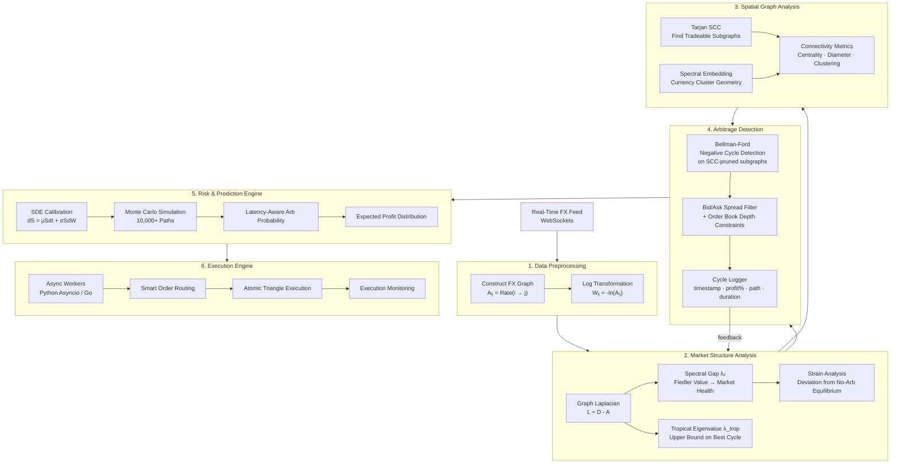

# FOREX_farming

A real-time triangular arbitrage detector built on graph theory, spectral analysis, and stochastic modelling. Connects to live cryptocurrency exchange feeds, analyses market structure before searching for cycles, and logs opportunities with full risk metrics.

> Currently built against Binance WebSocket streams (BTC, ETH, BNB, SOL) over a K4 complete graph — 6 live trading pairs, no central hub.

## Disclaimer

This project is a research and learning tool. Detected cycles are logged and analysed — not automatically traded. Real arbitrage on live exchanges is dominated by co-located HFT infrastructure. The value here is in the pattern analysis, not execution.

---

## How it works

Most arbitrage detectors run Bellman-Ford on the full exchange rate graph every tick and hope for the best. This project does something different: it analyses market *structure* first, uses that to prune the graph, and only then hunts for negative cycles — on a fraction of the original problem.

Each layer gates the next.

---

## Architecture

### Layer 1 — Data Preprocessing

Raw WebSocket tick data arrives as bid/ask order book snapshots. Each tick constructs a directed FX graph where every edge `Aᵢⱼ` is the exchange rate going from asset `i` to asset `j` — using the best bid when selling, `1/ask` when buying. The graph is then log-transformed into weight matrix `W`, where `Wᵢⱼ = -ln(Aᵢⱼ)`. This turns the multiplicative arbitrage problem into an additive one: a profitable loop (product of rates > 1) becomes a negative-weight cycle in `W`.

### Layer 2 — Market Structure Analysis

Before searching for anything, the market is assessed for whether it is even worth searching. Three signals are computed from the Graph Laplacian `L = D - A`:

**Spectral Gap (λ₂ — Fiedler value)** is the second-smallest eigenvalue of L. A high value means the market is well-connected and rates propagate quickly — arbitrage closes fast. A low value means the graph is fragmented or under stress, and any cycles that appear may be *persistent* rather than transient. Low λ₂ is the interesting regime.

**Tropical Eigenvalue (λ_trop)** comes from max-plus algebra and gives the minimum mean cycle weight across the entire graph — a mathematical upper bound on the best arbitrage rate achievable. If λ_trop ≥ 0, no profitable cycle can exist this tick and detection is skipped entirely.

**Strain** measures how far the observed rate network deviates from the no-arbitrage equilibrium — the state where every closed loop has a product of exactly 1 (i.e. sum of W around any cycle = 0). High strain means large mispricing somewhere in the graph. Strain is continuously updated via feedback from the Cycle Logger, creating a self-calibrating health signal.

### Layer 3 — Spatial Graph Analysis

Structure tells you the *health* of the market; spatial analysis tells you *where* to look. Tarjan's algorithm finds Strongly Connected Components — the subsets of assets where every node can reach every other node via directed edges. Any pair with no liquid market drops out of the SCC and is never touched by Bellman-Ford. Spectral embedding then projects the remaining nodes into a low-dimensional geometry using the eigenvectors of L, surfacing which currency clusters move together and making structural breaks visually detectable. Connectivity metrics (centrality, diameter, clustering coefficient) are computed on the pruned graph and exposed as runtime diagnostics.

### Layer 4 — Arbitrage Detection

Bellman-Ford runs only on the SCC-pruned subgraphs passed up from Layer 3, and only when Layer 2's tropical eigenvalue confirms a negative cycle is mathematically possible. Every detected cycle is passed through a bid/ask spread filter and order book depth check — if the cycle profit does not survive realistic fill costs, it is discarded. Surviving cycles are written to the Cycle Logger with their full path, gross and net profit percentage, and timestamp. Logged data feeds back into Layer 2's strain computation.

### Layer 5 — Risk & Prediction Engine

A stochastic differential equation `dS = μSdt + σSdW` is calibrated from recent rate history for each asset pair. 10,000+ Monte Carlo paths are simulated forward to estimate the probability that a detected cycle remains open long enough to execute, given observed latency. The output is an expected profit distribution — not a single number, but a full picture of the range of outcomes before a trade is committed.

### Layer 6 — Execution Engine *(planned)*

Async workers fire coordinated orders across the legs of the cycle simultaneously. Smart order routing selects between limit and market orders based on depth. Atomic triangle execution ensures all three legs are treated as a single logical operation — a partial fill on one leg triggers cancellation of the others. Execution monitoring tracks slippage and feeds realised P&L back into the Monte Carlo calibration.

---

## The math in one paragraph

Taking the log of exchange rates converts triangular arbitrage from a multiplicative to an additive problem. A loop `i → j → k → i` is profitable when `Aᵢⱼ · Aⱼₖ · Aₖᵢ > 1`, which after log-transform becomes `Wᵢⱼ + Wⱼₖ + Wₖᵢ < 0` — a negative-weight cycle. Bellman-Ford detects these in O(VE) time. The spectral gap of the Laplacian controls how quickly such mispricings diffuse through the network; the tropical eigenvalue bounds how profitable the best cycle can be without running detection at all; and Tarjan SCC ensures the algorithm only operates on the reachable, liquid portion of the graph.

---

## Current status

| Layer | Status |
|---|---|
| WebSocket feed + order book dashboard | ✅ Done |
| K4 graph construction (6 live pairs) | ✅ Done |
| FX graph + log transform | ✅ Done |
| Bellman-Ford cycle detection | ✅ Done |
| Spectral / structural analysis | 🔧 In progress |
| Spatial analysis + SCC pruning | 🔧 In progress |
| Cycle Logger | 🔧 In progress |
| Risk & Monte Carlo engine | 📋 Planned |
| Execution engine | 📋 Planned |

---

## Stack

- **Python** — core pipeline, asyncio event loop
- **websockets** — Binance real-time order book feed
- **numpy / scipy** — Laplacian construction, eigenvalue computation
- **Go** *(planned)* — execution layer for sub-millisecond order dispatch

---

